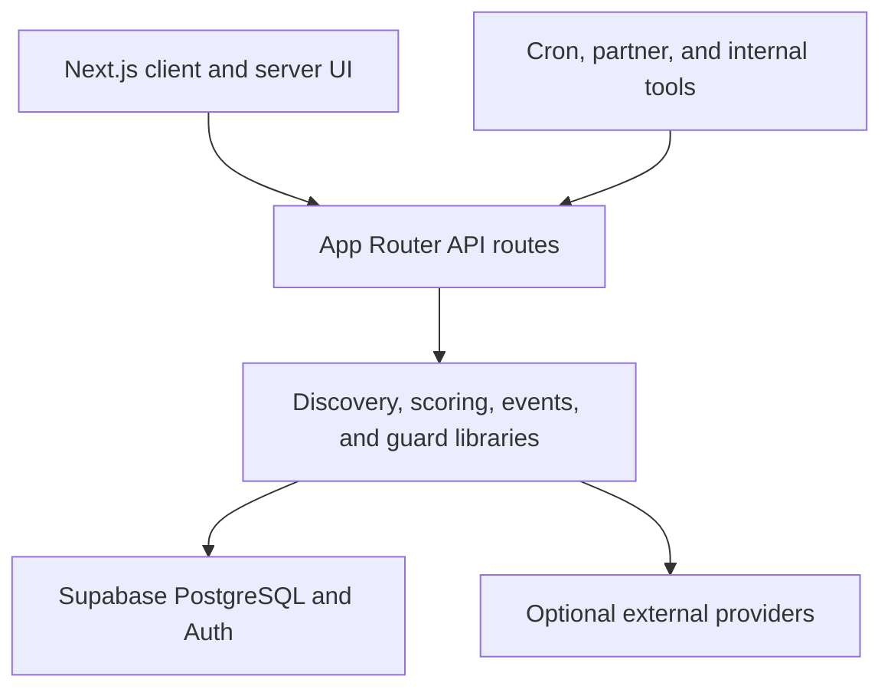

# Buzz / LIT757

Buzz is a real-time discovery app for Hampton Roads. It combines venue data,
official events, public context, forecasts, and short-lived first-party
observations to answer a practical question: **where is worth going right now?**

The production app is a Next.js 16 App Router application deployed on Vercel.
Supabase provides authentication and PostgreSQL storage, and Mapbox renders the
discovery maps.

## What is in the product

- Ranked venue and event discovery across the 757
- Live and forecast Buzz scores with explicit confidence and provenance
- Map, district, nearby, and intent-based discovery views
- Authenticated favorites, alerts, event engagement, and activity reports
- Verified-nearby crowd reporting and trusted ground-truth ingestion
- Provider health, data quality, calibration, and internal operations views
- Optional official calendars, ticketing, traffic, weather, venue enrichment,
  push notification, and AI integrations

Missing optional provider keys should degrade the related integration, not stop
the core application from building. Supabase and Mapbox are the core runtime
dependencies for the full experience.

## Quick start

Requirements:

- Node.js 20
- npm
- A Supabase project for authenticated/data-backed flows
- A Mapbox public token for map views

```bash
git clone <repository-url>
cd lit757
cp .env.example .env.local
npm ci
npm run dev
```

Open <http://localhost:3000>.

For a smoke-test build without real production credentials, placeholder values
are sufficient:

```bash
NEXT_PUBLIC_SUPABASE_URL=https://example.supabase.co \
NEXT_PUBLIC_SUPABASE_ANON_KEY=test-only-placeholder \
SUPABASE_SERVICE_ROLE_KEY=test-only-placeholder \
NEXT_PUBLIC_MAPBOX_TOKEN=test-only-placeholder \
npm run build
```

Never use placeholder values in a deployed environment.

## Validation

Run the complete local gate before opening a pull request:

```bash
npm run validate
```

The individual checks are:

```bash
npm test
npm run lint
npm run typecheck
npm run build
npm run security:audit
npm run test:e2e
```

Tests use Node's built-in test runner with `tsx`; no external test service is
required. Playwright runs the same discovery smoke and accessibility contracts
at desktop and iPhone-sized viewports. Install its local browser once with
`npx playwright install chromium`. GitHub Actions installs Chromium and runs
both viewport projects automatically, alongside TypeScript, lint, the
production build, dependency audit, and CodeQL.

## Architecture



Important directories:

| Path | Responsibility |
| --- | --- |
| `app/` | Pages, client experiences, and App Router API endpoints |
| `src/lib/buzz/` | Buzz scoring, calibration, repositories, providers, and product intelligence |
| `src/lib/events/` | Official/public event adapters and normalization |
| `src/lib/integrations/` | Weather, transit, coastal, and public-context adapters |
| `src/lib/server/` | Shared request size, secret, client-key, and rate-limit guards |
| `app/hooks/use-buzz-mapbox.ts` | Mapbox lifecycle, layers, logo pins, and responsive map synchronization |
| `app/buzz-map-presentation.ts` | Shared logo zoom thresholds and hottest-venue selection |
| `app/buzz-map-logo-sprite.ts` | Activity-ring logo sprites with deterministic initials fallback |
| `app/components/buzz-venue-list.tsx` | One venue-list implementation shared by desktop and mobile layouts |
| `lib/supabase-admin.ts` | Singleton service-role client and authenticated-user boundary |
| `instrumentation.ts` | Core environment validation before a Node server becomes ready |
| `e2e/` | Playwright desktop/mobile smoke and accessibility coverage |
| `supabase/migrations/` | Ordered database schema, RLS, policy, and reconciliation changes |
| `.github/workflows/` | Build, security, dependency, and CodeQL checks |

### Request trust boundaries

| Route class | Expected credential | Database behavior |
| --- | --- | --- |
| Public discovery reads | None | Reads sanitized discovery data |
| Member writes | Supabase bearer token | Resolves the user server-side; never trusts a body `userId` |
| Nearby crowd report | Supabase bearer token plus server-checked location | Writes short-lived evidence and can affect reputation/points |
| Partner pulse | `BUZZ_PARTNER_INGEST_SECRET` | Writes short-lived official venue evidence |
| Ground truth and calibration | `BUZZ_GROUND_TRUTH_SECRET` | Trusted server-side evidence/calibration only |
| Scheduled maintenance | `CRON_SECRET` | Internal refresh, expiry, and notification work |

The service-role key belongs only in server routes. Any variable prefixed
`NEXT_PUBLIC_` is shipped to browsers and must be safe to expose.

All App Router endpoints obtain service-role access through
`getSupabaseAdmin()`. Do not create ad hoc service-role clients in route files.
At Node server startup, instrumentation verifies that the Supabase URL, anon
key, service-role key, and Mapbox token exist and that the Supabase URL is
valid. Optional provider keys remain lazy and non-blocking.

The responsive map uses the same presentation rules on desktop and mobile:
heat-only at city zoom, collision-aware hottest-venue logos at medium zoom, and
the wider logo set at close zoom. A provider image failure becomes an initials
logo with the same Buzz activity ring instead of an anonymous map bubble.
Heating Up venues receive an orange pulse and On Fire venues receive a red
pulse; reduced-motion clients receive the same signal as a static halo. The
Buzzing filter isolates those Heating Up and On Fire venues with one tap.
The map screen delegates Mapbox behavior, the responsive venue list, and the
responsive venue-detail surface to focused shared modules so desktop and mobile
use the same activity thresholds and interactions. Venue cards are native
keyboard controls; opening details moves focus into the panel, Escape closes
it, and focus returns to the launching venue.

## Environment variables

Copy `.env.example` and fill only the integrations you are working on. Configure
the same names in Vercel for Production, Preview, and Development as appropriate.

### Core

| Variable | Visibility | Purpose |
| --- | --- | --- |
| `NEXT_PUBLIC_SITE_URL` | Public | Canonical app URL |
| `NEXT_PUBLIC_SUPABASE_URL` | Public | Supabase project URL |
| `NEXT_PUBLIC_SUPABASE_ANON_KEY` | Public | Supabase browser key, constrained by RLS |
| `SUPABASE_SERVICE_ROLE_KEY` | Server only | Privileged database access from protected routes |
| `NEXT_PUBLIC_MAPBOX_TOKEN` | Public | Map rendering |
| `CRON_SECRET` | Server only | Scheduled maintenance authentication |

### Buzz trust secrets

| Variable | Requirement |
| --- | --- |
| `BUZZ_PARTNER_INGEST_SECRET` | Unique random value, at least 32 characters |
| `BUZZ_GROUND_TRUTH_SECRET` | Separate unique random value, at least 32 characters |

Do not reuse `CRON_SECRET` for either Buzz secret.

### Optional integrations

The complete list and inline notes live in `.env.example`. Major groups are:

- Venue enrichment: Google Places, Google Street View, Brandfetch, Overpass
- Events: Ticketmaster, Eventbrite, SeatGeek, and HTTPS ICS feeds
- Context: AirNow, NPS, HRT GTFS-Realtime, PredictHQ, TomTom
- Notifications: VAPID keys
- Account communication: Resend and optional owner-signup webhook
- AI: `OPENAI_API_KEY`; `AI_GATEWAY_API_KEY` is currently reserved for a
  planned gateway integration
- Buzz forecast providers: BestTime and Ticketmaster Inventory

`LOCAL_EVENT_FEEDS_JSON` must be a JSON array:

```json
[
  {
    "name": "Example Venue",
    "url": "https://example.com/calendar.ics",
    "source": "example_venue",
    "venueName": "Example Venue"
  }
]
```

Use official HTTPS calendar feeds. Do not commit `.env.local`, keys, access
tokens, exported Vercel values, or screenshots containing secrets.

## Database migrations

Migrations are append-only production history. Apply files from
`supabase/migrations` in filename order.

Before applying production changes:

1. Create and verify a production database backup.
2. Compare Supabase migration history with the repository.
3. Apply only missing files, oldest first.
4. Stop on the first failure and investigate; do not skip ahead.
5. Verify RLS, policies, grants, functions, and triggers after the migration.

The current sequence culminates in:

- `20260723170000_buzz_realtime_platform.sql` — real-time platform structures
- `20260724150000_security_reconciliation.sql` — closes raw evidence access,
  protects server-managed verification fields, and forces RLS on user-owned
  tables

The reconciliation migration was designed to be idempotent, but it still
requires a backup and review before production application.

Migration tests fail on duplicate versions or newly created tables without RLS:

```bash
npm test
```

## Buzz data model

The platform migration provides these major structures:

- Signal provenance and current score snapshots
- Prediction/score history and ground-truth observations
- Calibration models and training statistics
- Observer reputation and venue watches
- Alert deliveries and area snapshots
- Group rooms, votes, and temporary scenes
- Verified business facts and product analytics

Raw evidence is server-owned. Public clients read sanitized API responses and
score snapshots; they do not receive direct access to observer identities,
invite codes, raw provenance, or calibration data.

## Ground-truth submissions

`POST /api/buzz/ground-truth` is for trusted internal tools and testers only.
Every request requires:

```http
Authorization: Bearer <BUZZ_GROUND_TRUTH_SECRET>
Idempotency-Key: <unique-16-to-128-character-value>
Content-Type: application/json
```

Example body:

```json
{
  "venueId": "venue-id",
  "observedAt": "2026-07-24T20:30:00.000Z",
  "occupancyBand": "busy",
  "occupancyPct": 76,
  "queueMinutes": 12,
  "notes": "Trusted field observation",
  "metadata": {
    "source": "beta-tester"
  }
}
```

Do not place the secret in a browser bundle or public form. Put a protected
server or internal tool in front of this route.

## Deployment

Production is deployed by Vercel from `main`.

1. Open a pull request.
2. Wait for GitHub validation and the Vercel preview to become Ready.
3. Review security-sensitive route, migration, workflow, and configuration
   changes explicitly.
4. Merge only after required checks pass.
5. Confirm the resulting production deployment is Ready.
6. Smoke-test discovery, authentication, maps, and one protected route.

Provider variables added in Vercel require a redeploy before serverless
functions can read them.

## Engineering conventions

- Keep browser-safe and server-only configuration visibly separate.
- Validate identity from the bearer token; never accept ownership from request
  JSON.
- Bound request bodies and strings before calling providers or the database.
- Put expensive or privileged routes behind authentication, strong secrets, or
  both, plus rate limits and timeouts where relevant.
- Keep server-owned tables inaccessible to `anon` and `authenticated` roles.
- Add migrations instead of editing production history after it has shipped.
- Comment trust boundaries, invariants, fallbacks, and non-obvious integration
  behavior. Avoid comments that merely restate the next line of code.
- Add tests alongside deterministic scoring, parsing, guard, and migration
  behavior.
- Keep responsive behavior in shared components and verify changes in both
  Playwright viewport projects.

## Known setup-dependent work

These items cannot be completed from source code alone:

- Applying and verifying production Supabase migrations
- Adding provider/API keys and production secrets
- Registering provider applications and accepting gated-model terms
- Deploying a dedicated external ML worker
- Configuring production backups, usage alerts, monitoring destinations, and
  provider-specific alert destinations

The app can still be tested, documented, linted, type-checked, audited, and
built while those credentials are pending.
